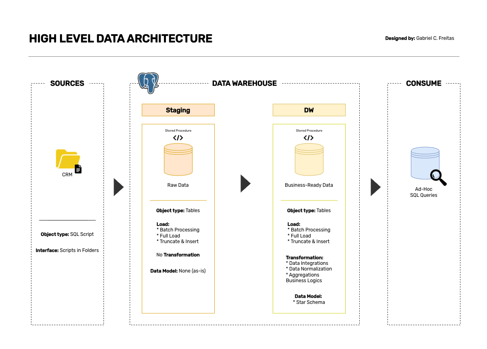

# Data Warehouse and Analytics Project

Welcome to the **Data Warehouse and Analytics Project** repository!  
This project demonstrates a comprehensive data warehousing and analytics solution, from building a data warehouse to generating actionable insights. Designed as a portfolio project, it highlights industry best practices in data engineering and analytics.

---

## Project Overview

This project involves:

1. **Data Architecture**: Designing a Modern Data Warehouse.
2. **ETL Pipelines**: Extracting, transforming, and loading data from source system into the warehouse.
3. **Data Modeling**: Developing fact and dimension tables optimized for analytical queries.
4. **Analytics & Reporting**: Creating SQL-based reports and dashboards for actionable insights.

This repository is an excellent resource for professionals and students looking to showcase expertise in:
- SQL Development
- Data Architect
- Data Engineering  
- ETL Pipeline Developer  
- Data Modeling  
- Data Analytics 

---

## Data Architecture

The data architecture for this project includes **Staging** and **Data Warehouse** layers:


1. **Staging Layer**: Stores raw data as-is from the source systems. Data is ingested from CSV Files into SQL Server Database.
2. **Data Warehouse Layer**: Houses business-ready data modeled into a star schema required for reporting and analytics.

## Important Links & Tools:

Everything is for Free!
- **[Datasets](datasets/):** Access to the project dataset (sql files).
- **[PostgreSQL](https://www.postgresql.org/download/):** Open source relational database for hosting your SQL database.
- **[DBeaver Community](https://dbeaver.io/download/):** GUI for managing and interacting with databases.
- **[Git Repository](https://github.com/):** Set up a GitHub account and repository to manage, version, and collaborate on your code efficiently.
- **[DrawDB](https://www.drawdb.app/):** Design data models.
- **[DrawIO](https://www.drawio.com/):** Design data architecture, flows, models, and diagrams.

---

## Project Requirements

### Building the Data Warehouse (Data Engineering)

#### Objective
Develop a modern data warehouse using SQL Server to consolidate sales data, enabling analytical reporting and informed decision-making.

#### Specifications
- **Data Sources**: Import data from a source system (CRM) provided as SQL file.
- **Scope**: Focus on the latest dataset only; historization of data is not required.
- **Documentation**: Provide clear documentation of the data model to support both business stakeholders and analytics teams.

---

## 📂 Repository Structure
```
sql_pentarruda_data_warehouse_project/
│
├── datasets/                           # Raw dataset used for the project (CRM data)
│
├── docs/                               # Project documentation and architecture details
│   ├── data_architecture.png           # Draw.io file shows the project's architecture
│
├── scripts/                            # SQL scripts for ETL and transformations
│
├── tests/                              # Test scripts and quality files
│
├── README.md                           # Project overview and instructions
├── LICENSE                             # License information for the repository
├── .gitignore                          # Files and directories to be ignored by Git
└── requirements.txt                    # Dependencies and requirements for the project
```

---

## License

This project is licensed under the [MIT License](LICENSE). You are free to use, modify, and share this project with proper attribution.

## About Me

Hi there! I'm **Gabriel Cardoso Freitas**.

Let's stay in touch! Feel free to connect with me on the following platforms:

[](https://linkedin.com/in/gcfreitas)
